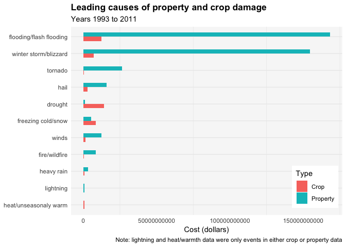

# Storm Data Analysis: Fatalities and cost of damage
By Liz Anderson

## Synopsis
This messy data set required much data processing to assure count of all fatalities and costs caused by weather events in the United States from 1993 to 2011. The majority of fatalities caused by excessive heat far exceeds those of other events with tornado and floods close for second leading cause of fatalities. Also observed was the cost of damage for both property and crops, with flooding and winter storms leading the property damage and flooding, drought, and freezing temperatures affecting crop damage. 

## Data Processing


```r
data_raw <- fread("repdata_data_StormData.csv", select = c("BGN_DATE", "EVTYPE","FATALITIES", "PROPDMG", "PROPDMGEXP","CROPDMG","CROPDMGEXP"))
data <- na.omit(data_raw)

# Many event types were very similar or spelt wrong. To understand the affects of storms, categorizing the data will be helpful for a high-level examination.
data$EVTYPE <- as.character(tolower(data$EVTYPE))
data$EVTYPE[grepl("hurricane|tropical storm",data$EVTYPE)] <- "hurricane\tropical storm"
data$EVTYPE[grepl("heat|warm",data$EVTYPE)] <- "heat/unseasonaly warm"
data$EVTYPE[grepl("ice|freezing|freeze|snow|cold|windchill|low temperature|frost",data$EVTYPE)] <- "freezing cold/snow"
data$EVTYPE[grepl("winter|storm|blizzard",data$EVTYPE)] <- "winter storm/blizzard"
data$EVTYPE[grepl("storm surge",data$EVTYPE)] <- "storm surge"
data$EVTYPE[grepl("flood|flooding",data$EVTYPE)] <- "flooding/flash flooding"
data$EVTYPE[grepl("current|currents",data$EVTYPE)] <- "rip current"
data$EVTYPE[grepl("tstm|thunderstorm wind",data$EVTYPE)] <- "thunderstorm wind"
data$EVTYPE[grepl("fire",data$EVTYPE)] <- "fire/wildfire"
data$EVTYPE[grepl("hail",data$EVTYPE)] <- "hail"
data$EVTYPE[grepl("high winds|strong winds|high wind|strong wind|gusty",data$EVTYPE)] <- "heavy/strong winds"
data$EVTYPE[grepl("high surfs|heavy surfs|high surf|heavy surf|high sea|high seas|rough seas",data$EVTYPE)] <- "heavy/high surf/sea"
data$EVTYPE[grepl("avalanche|avalance",data$EVTYPE)] <- "avalanche"
data$EVTYPE[grepl("hypothermia",data$EVTYPE)] <- "hypothermia/exposure"
data$EVTYPE[grepl("lightning",data$EVTYPE)] <- "lightning"
data$EVTYPE[grepl("tornado",data$EVTYPE)] <- "tornado"
data$EVTYPE[grepl("mudslide|landslide",data$EVTYPE)] <- "mudslide/landslide"
data$EVTYPE[grepl("heavy rain|heavy rains|rain|hvy rain",data$EVTYPE)] <- "heavy rain"
data$EVTYPE[grepl("wind|winds",data$EVTYPE)] <- "winds"

# Health data processing for fatalities
health <- data.frame(as.Date(data$BGN_DATE, "%m/%d/%Y"), as.character(tolower(data$EVTYPE)), as.numeric(data$FATALITIES))
colnames(health) <- c("date", "event", "fatalities")
health <- separate(health,date,into=c("year","month","day"),sep="-", drop=TRUE)

# As factor affects further analysis, need to be char.
health$event = as.character(health$event)

# Property and crop data processing
prop_dmg <- data.frame(as.Date(data$BGN_DATE, format = "%m/%d/%Y"), data$EVTYPE, as.numeric(data$PROPDMG), as.character(data$PROPDMGEXP), as.numeric(data$CROPDMG), as.character(data$CROPDMGEXP))
colnames(prop_dmg) <- cbind("date", "event", "prop", "prop_x", "crop", "crop_x")
prop_dmg <- separate(prop_dmg,date,into=c("year","month","day"),sep="-", drop=TRUE)

# Need to determine numerical cost for both property damage
# and crop data utilizing the exponential key column.
prop_dmg$prop_exp[prop_dmg$prop_x == ""] <- 1
prop_dmg$prop_exp[prop_dmg$prop_x == "0"] <- 1
prop_dmg$prop_exp[prop_dmg$prop_x == "1"] <- 10
prop_dmg$prop_exp[prop_dmg$prop_x == "2"] <- 100
prop_dmg$prop_exp[prop_dmg$prop_x == "h"] <- 100
prop_dmg$prop_exp[prop_dmg$prop_x == "H"] <- 100
prop_dmg$prop_exp[prop_dmg$prop_x == "3"] <- 1000
prop_dmg$prop_exp[prop_dmg$prop_x == "K"] <- 1000
prop_dmg$prop_exp[prop_dmg$prop_x == "4"] <- 10000
prop_dmg$prop_exp[prop_dmg$prop_x == "5"] <- 1e+05
prop_dmg$prop_exp[prop_dmg$prop_x == "6"] <- 1e+06
prop_dmg$prop_exp[prop_dmg$prop_x == "m"] <- 1e+06
prop_dmg$prop_exp[prop_dmg$prop_x == "M"] <- 1e+06
prop_dmg$prop_exp[prop_dmg$prop_x == "7"] <- 1e+07
prop_dmg$prop_exp[prop_dmg$prop_x == "8"] <- 1e+08
prop_dmg$prop_exp[prop_dmg$prop_x == "B"] <- 1e+09
# Invalid data, will be multiplied out
prop_dmg$prop_exp[prop_dmg$prop_x == "+"] <- 0
prop_dmg$prop_exp[prop_dmg$prop_x == "-"] <- 0
prop_dmg$prop_exp[prop_dmg$prop_x == "?"] <- 0
# Compute the property damage value
prop_dmg$prop_cost <- prop_dmg$prop * prop_dmg$prop_exp

# Start of crop data
prop_dmg$crop_exp[prop_dmg$crop_x == "0"] <- 1
prop_dmg$crop_exp[prop_dmg$crop_x == ""] <- 1
prop_dmg$crop_exp[prop_dmg$crop_x == "2"] <- 100
prop_dmg$crop_exp[prop_dmg$crop_x == "k"] <- 1000
prop_dmg$crop_exp[prop_dmg$crop_x == "K"] <- 1000
prop_dmg$crop_exp[prop_dmg$crop_x == "M"] <- 1e+06
prop_dmg$crop_exp[prop_dmg$crop_x == "m"] <- 1e+06
prop_dmg$crop_exp[prop_dmg$crop_x == "B"] <- 1e+09
# Invalid data, will be multiplied out
prop_dmg$crop_exp[prop_dmg$crop_x == "?"] <- 0
# Compute the crop damage value
prop_dmg$crop_cost <- prop_dmg$crop * prop_dmg$crop_exp
```
```

# Results

## Health data: Fatalities
### Which weather events cause the most fatalities?


```r
health_fatalities <- health %>%
  select(event, year, fatalities) %>%
  filter(year > "1992" & fatalities > 0) %>%
  group_by(year,event) %>%
  summarise(fatalities = sum(fatalities)) %>%
  arrange(year, event, fatalities) 

top_10_fatalities_events <- health_fatalities %>%
  ungroup(year) %>%
  select(-year) %>%
  group_by(event) %>%
  summarise(fatalities = sum(fatalities)) %>%
  top_n(n=10, wt=fatalities) %>%
  ungroup() %>% arrange(desc(fatalities)) %>%
  # for plotting color purposes
  mutate(highlight = ifelse(grepl("heat|flood|tornado", event), "T", "F")) 

ggplot(top_10_fatalities_events, aes(x=reorder(event, -desc(fatalities)), y=fatalities)) +
  geom_bar(aes(fill=highlight), stat="identity", width=0.5) +
  coord_flip() + theme_bw() + scale_fill_manual(values=co) +
  labs(y="Total Fatalities", 
       title="Lead Causes of Fatalities by Weather", 
       subtitle="Years 1993 to 2011", 
       caption="Source: https://github.com/") + health_theme
```

<!-- -->

## Finacial data: Property and crops roll up

```r
prop_data <- prop_dmg %>% select(year, event, prop_cost) %>%
    filter(prop_cost > 0, year > "1992") %>%
    group_by(year, event) %>%
    summarise(cost = sum(prop_cost)) %>%
    arrange(year, event, desc(cost)) %>%
  # for plotting purposes
    mutate(highlight = "P")

crop_data <- prop_dmg %>% select(year, event, crop_cost) %>%
  filter(crop_cost > 0) %>%
  group_by(year, event) %>%
  summarise(cost = sum(crop_cost)) %>%
  arrange(year, event, desc(cost)) %>%
  # for plotting purposes
  mutate(highlight = "C")
```

### Which weather events cause the most crop and property damage?


```r
# Find top 10 causes of crop and propety damage
top_prop_dmg_events_10 <- prop_data %>%
  ungroup(year) %>%
  select(-year) %>%
  group_by(event) %>%
  summarise(cost = sum(cost)) %>%
  top_n(n=10, wt=cost) %>%
  ungroup() %>% arrange(desc(cost)) %>%
  mutate(Type = "Property")

top_crop_dmg_events_10 <- crop_data %>%
  ungroup(year) %>%
  select(-year) %>%
  group_by(event) %>%
  summarise(cost = sum(cost)) %>%
  top_n(n=10, wt=cost) %>%
  ungroup() %>% arrange(desc(cost)) %>%
  mutate(Type = "Crop")

# Combine data to see how it compares to each other
all_crop_prop_dmg_10 <- rbind(top_prop_dmg_events_10, top_crop_dmg_events_10)

# Graph both property and crop data to empahsize the affects of weather for crops and property are starkly different.
ggplot(all_crop_prop_dmg_10, aes(x=reorder(event, -desc(cost)), y=cost)) +
  geom_bar(aes(fill=Type), stat="identity", width=0.5, position = "dodge") +
  coord_flip() + theme_bw() +
  labs(y="Cost (dollars)",  
       title="Leading causes of property and crop damage", 
       subtitle="Years 1993 to 2011", 
       caption="Note: lightning and heat/warmth data were only events in either crop or property data") + 
       cost_theme
```

<!-- -->
